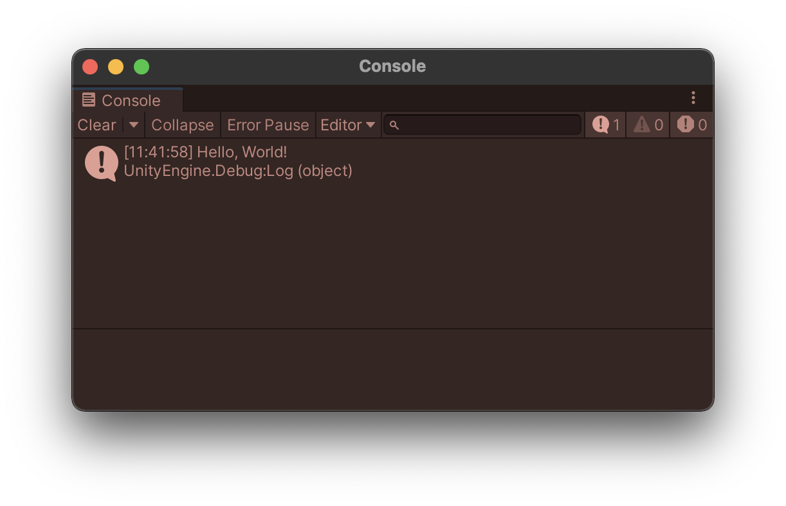

After installing UniDi in Unity, let us show you an example to illustrate its basics.

## Source code

Take a look at the next code. It will log: _'Hello, World!'_ into the Unity console.

```cs
using UniDi;
using UnityEngine;

public class TestInstaller : MonoInstaller
{
    public override void InstallBindings()
    {
        Container.Bind<string>().FromInstance("Hello, World!");
        Container.Bind<Greeter>().AsSingle().NonLazy();
    }
}

public class Greeter
{
    public Greeter(string message)
    {
        Debug.Log(message);
    }
}
```

You can run this code by doing the following:

## Add a Scene Context

1. Create a new scene in Unity
2. Right click inside the _Hierarchy_ panel and select **UniDi > Scene Context** from the popup menu.


## Create a Mono Installer

3. Navigate to the *Assets* folder in the _Project_ panel. Right click in the Assets folder and select **Create > UniDi > MonoInstaller**.
Save it as _TestInstaller.cs_.


4. Drag your **TestInstaller** script onto a **Game Object** in the scene. This can be any Game Object, it doesn't matter.
_(In this example we are using the Scene Context Game Object as it's more convenient for the screenshots.)_

## Add a reference to the installer

5. In the **Scene Context** Inspector view. **Add a reference to the Test Installer** by adding a new row in the inspector of the _Mono Installers_ property (press the `+` button) and then drag the Test Installer component on top of it.


## Addding the source code

6. Copy the given source code. Open the file _TestInstaller.cs_ in an text editor, paste the source into the file and save.

## Run

7. Hit the `Play` button in Unity and observe the console window for its output. If everything went well you should see a 'Hello, World!' message.



## Wrapping it up

:::tip Woah, what just happened?
* The **Scene Context MonoBehaviour is the entry point of the application**, where UniDi sets up all the various dependencies before kicking off your scene.  
* To add content to your UniDi scene, you need to write what is referred to in UniDi as an **Installer**, which declares all the dependencies and their relationships with each other.
* All dependencies that are marked as **NonLazy** are automatically created after the installers are run, which is why the Greeter class that we added above gets created on startup.

:::

If this all doesn't make sense to you yet, keep reading!
