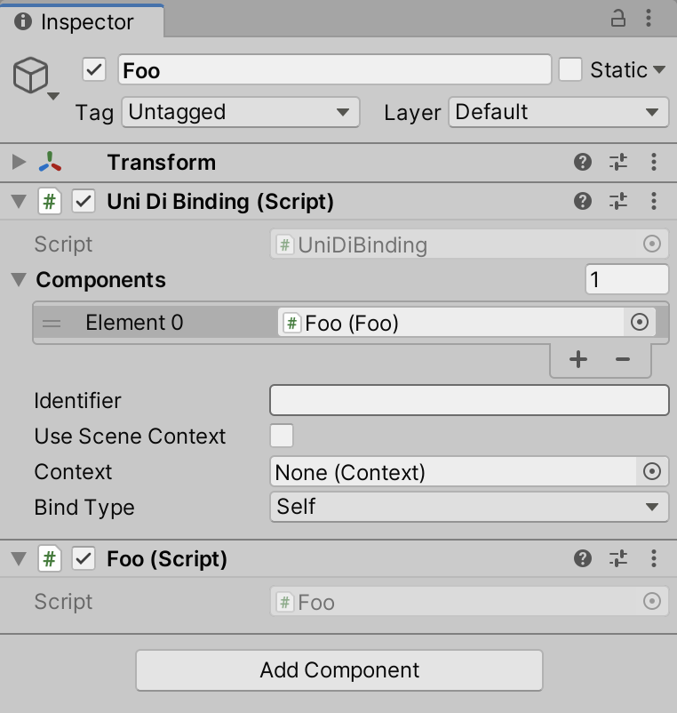

# Bind MonoBehaviours In The Scene

In many cases, you have a number of MonoBehaviours that have been added to the scene within the Unity editor (ie. at editor time not runtime) and you want to also have these MonoBehaviours added to the UniDi Container so that they can be injected into other classes.

## By reference

The usual way this is done is to add references to these components within your installer like this:

```cs
public class Foo : MonoBehaviour
{
}

public class GameInstaller : MonoInstaller
{
    [SerializeField] Foo _foo;

    public override void InstallBindings()
    {
        Container
			.BindInstance(_foo);

        Container
			.Bind<IInitializable>()
			.To<GameRunner>()
			.AsSingle();
    }
}

public class GameRunner : IInitializable
{
    readonly Foo _foo;

    public GameRunner(Foo foo)
    {
        _foo = foo;
    }

    public void Initialize()
    {
        // ...
    }
}
```

This works fine however in some cases this can get cumbersome. For example, if you want to allow an artist to add any number of `Enemy` objects to the scene, and you also want all those `Enemy` objects added to the UniDi Container. In this case, you would have to manually drag each one to the inspector of one of your installers. This is very error prone since its easy to forget one, or to delete the `Enemy` game object but forget to delete the null reference in the inspector for your installer, etc.

## FromComponentInHierarchy

Another way to do this would be to use the `FromComponentInHierarchy` bind method like this:

```cs
public class GameInstaller : MonoInstaller
{
    public override void InstallBindings()
    {
        Container
			.Bind<Foo>()
			.FromComponentInHierarchy()
			.AsTransient();

        Container
			.Bind<IInitializable>()
			.To<GameRunner>()
			.AsSingle();
    }
}
```

Now, whenever a dependency of type Foo is required, UniDi will search the entire scene for any MonoBehaviours of type `Foo`. This will function very similarly to use Unity's [FindObjectsOfType](https://docs.unity3d.com/ScriptReference/Object.FindObjectsOfType.html) method every time you want to look up a certain dependency. Note that because this method can be a very heavy operation, you probably want to mark it `AsCached` or `AsSingle` like this instead:

```cs
public class GameInstaller : MonoInstaller
{
    public override void InstallBindings()
    {
        Container.Bind<Foo>().FromComponentInHierarchy().AsCached();
        Container.Bind<IInitializable>().To<GameRunner>().AsSingle();
    }
}
```

This way, you only incur the performance hit for the search once the first time it is needed instead of every time it is injected to any class. Note also that we can `FromComponentsInHierarchy` (note the plural) in cases where we expect there to be multiple Foos.

## The UniDi Binding Component

Yet another way to do this is to use the `UniDiBinding` component. You can do this by adding a `UniDiBinding` MonoBehaviour to the same game object that you want to be automatically added to the UniDi container.

For example, if you have a MonoBehaviour of type Foo in your scene, you can just add `UniDiBinding` alongside it, and then drag the `Foo` component into the Component property of the `UniDiBinding` component.



Then our installer becomes:

```cs
public class GameInstaller : MonoInstaller
{
    public override void InstallBindings()
    {
        Container
			.Bind<IInitializable>()
			.To<GameRunner>()
			.AsSingle();
    }
}
```
## UniDi Binding Properties
The `UniDiBinding` component has the following properties:

## Identifier
This value can be left empty most of the time. It will determine what is used as the [identifier](./Binding#identifiers) for the binding. For example, when set to "Foo1", it is equivalent to doing the following:

```cs
Container.BindInstance(_foo).WithId("Foo1");
```

## Use Scene Context 
This is optional but useful in cases where you want to bind a dependency that is inside a GameObjectContext to the SceneContext. You could also drag the SceneContext to the Context properly but this flag is a bit easier.

## Context
This is completely optional and in most cases should be left unset. This will determine which `Context` to apply the binding to. If left unset, it will use whatever context the GameObject is in. In most cases this will be `SceneContext`, but if it's inside a `GameObjectContext` it will be bound into the `GameObjectContext` container instead. One important use case for this field is to allow dragging the `SceneContext` into this field, for cases where the component is inside a `GameObjectContext`. This allows you to treat this MonoBehaviour as a [Facade](https://en.wikipedia.org/wiki/Facade_pattern) for the entire sub-container given by the `GameObjectContext`.

## Bind Type
This will determine what 'contract type' to use. It can be set to any of the following values:
* [Self](#self)
* [AllInterfaces](#allinterfaces)
* [AllInterfacesAndSelf](#allinterfacesandself)
* [BaseType](#basetype)

### Self
This is equivalent to the first example where we did this:

```cs
Container.Bind<Foo>().FromInstance(_foo);
```

Or, equivalently:

```cs
Container.BindInstance(_foo);
```

So if we duplicate this game object to have multiple game objects with Foo on them (as well as the UniDiBinding), they will all be bound to the Container this way. So after doing this, we would have to change GameRunner above to take a `List<Foo>` otherwise we would get UniDi exceptions (see here for info on list bindings).

### AllInterfaces
This bind type is equivalent to the following:

```cs
Container.BindInterfacesTo(_foo.GetType()).FromInstance(_foo);
```
Note however, in this case, that GameRunner must ask for type IFoo in its constructor. If we left GameRunner asking for type Foo then UniDi would throw exceptions, since the BindInterfaces method only binds the interfaces, not the concrete type. If you want the concrete type as well then you can use:

### AllInterfacesAndSelf
This bind type is equivalent to the following:

```cs
Container.BindInterfacesAndSelfTo(_foo.GetType()).FromInstance(_foo);
```

This is the same as AllInterfaces except we can directly access Foo using type Foo instead of needing an interface.

### BaseType
This bind type is equivalent to the following:

```cs
Container.Bind(_foo.GetType().BaseType()).FromInstance(_foo)
```

