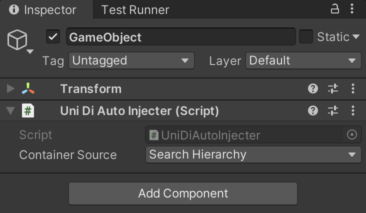

# Injection

<br/> 


## Inject Optional Dependency

You can declare some dependencies as optional as follows:

```csharp
public class Bar
{
    public Bar(
        [InjectOptional]
        IFoo foo)
    {
        // ...
    }
}
// ...

// This binding can be commented out without breaking:
Container.Bind<IFoo>().AsSingle();
```

Or, if you have an identifier as well:

```csharp
public class Bar
{
    public Bar(
        [Inject(Optional = true, Id = "foo1")]
        IFoo foo)
    {
        ...
    }
}
```

If an optional dependency is not bound in any installers, then it will be injected as null.

If the dependency is a primitive type (eg. `int,` `float`, `struct`) then it will be injected with its default value (eg. 0 for ints).

You may also assign an explicit default using the standard C# way such as:

```csharp
public class Bar
{
    public Bar(int foo = 5)
    {
        ...
    }
}
...

// Can comment this out and 5 will be used instead
Container.BindInstance(1);
```

Note also that the `[InjectOptional]` is not necessary in this case, since it's already implied by the default value.

Alternatively, you can define the primitive parameter as nullable, and perform logic depending on whether it is supplied or not, such as:

```csharp
public class Bar
{
    int _foo;

    public Bar(
        [InjectOptional]
        int? foo)
    {
        if (foo == null)
        {
            // Use 5 if unspecified
            _foo = 5;
        }
        else
        {
            _foo = foo.Value;
        }
    }
}

...

// Can comment this out and it will use 5 instead
Container.BindInstance(1);
```

<br/> 


## Auto Injecter Component

The sections [Instantiating GameObjects at Runtime](../Basic%20Principles/General-Guidelines-Tips-And-Tricks#instantiate-gameobjects-at-runtime) and [UniDi Factories](#TODO) explains that any dynamically instantiated object needs to be created through the DI framework in order to be injected.  
You cannot simply execute `GameObject.Instantiate(prefab)`, or call `new Foo()`.

Though this is the standard behavior/best practice for dependency injection, it can be problematic when using certain third party Unity assets/libraries.  
For example, some networking libraries work by automatically instantiating prefabs to sync state across multiple clients. And it is still desirable in these cases to execute UniDi injection.

To solve these special cases there's that special component you can add to these kinds of objects called UniDiAutoInjecter. If you add this component to your prefab, then you should be able to call GameObject.Instantiate and injection should happen automatically.



### Container Source
After adding this component you might notice that there is a field on it called 'Container Source'. This value will determine how it calculates which container to use for the injection and has the following options:

* ### SearchInHiearchy
This will find the container to use by searching the scene hierarchy where the prefab is instantiated. So if the prefab is instantiated underneath a GameObjectContext, it will use the container associated with the GameObjectContext. If it is instantiated underneath a DontDestroyOnLoad object, then it will use the ProjectContext container. And otherwise will use the SceneContext container for whatever scene it is instantiated in.

* ### SceneContext
Don't bother searching the hierarchy and instead just always use the current SceneContext container.

* ### ProjectContext
Don't bother searching the hierarchy and instead just always use the ProjectContext container.

<br/> 


## LazyInject
### Postponing the creation of a dependency

When you wrap the dependencies in your constructs with `LazyInject<T>`, you delay - after the object graph is composed - the creation of that dependency.

The example below demonstrates that **only** when `Bar.Run()` is called. An instance of **Foo** will be created 

```csharp
public class ExampleInstaller : MonoInstaller<ExampleInstaller>
{
    public override void InstallBindings()
    {
        Container.Bind<IFoo>().To<Foo>().AsSingle();
        Container.Bind<Bar>().AsSingle();
    }
}

public class Foo : IFoo
{
    public void Run()
    {
        // ...
    }
}

public class Bar
{
    LazyInject<Foo> _foo;

    public Bar(LazyInject<Foo> foo)
    {
        _foo = foo;
    }

    public void Run()
    {
        _foo.Value.Run();
    }
}
```
Note that the installers remain the same in both cases. Any injected dependency can be made lazy by simply wrapping it in `LazyInject<>`.

:::danger Leaky Abstractions
Creating dependecies on the fly with LazyInject may sound as a valid concern. But what isn't, is to push those concerns on to the Dependency's consumers. If you do this, your are leaking details about the implementation and implementation choices of the Composition Root to the consumer. The Dependency becomes a Leaky Abstraction, and you are violating the Dependency Inversion Principle.

**More problems to concider:**
* Letting a consumer depend on LazyInject **complicates the consumer and its unit tests**.
* **Changing** an existing Dependency to a lazy Dependency later in the development process **causes sweeping changes throughout the application**.
* Because the amount of changes you have to make and the number of tests you need to add, it becomes **quite easy to make programming mistakes** that would completely nullify these changes. 
:::

:::note When you really have no choice
This doesn’t mean that you aren’t allowed to construct your Dependencies lazily, though. We’d like to stress that: you should keep the constructors of your components free of any logic other than Guard Clauses and the storing of incoming Dependencies. This makes the construction of your classes fast and reliable, and will prevent such components from ever becoming expensive to instantiate.  
In some cases, however, you’ll have no choice; for instance, when dealing with third- party components you have little control over. In that case, LazyInject is a great tool. But rather than letting all consumers depend on LazyInject, you should hide LazyInject behind a Virtual Proxy and place that Virtual Proxy within the Composition Root.
:::

If you want to read more... Chapter 8.4.2 - "Using Leaky Abstractions to leak lifeStyle choices to consumers" of the [Dependency Injection Principles, Practices, and Patterns](https://www.manning.com/books/dependency-injection-principles-practices-patterns) book goes deeper into the subject of Lazy Injection.

<br/> 


## Open Generic Types
UniDi also has a feature that allow you to automatically fill in open generic arguments during injection. For example:

```csharp
public class Bar<T>
{
    public int Value
    {
        get; set;
    }
}

public class Foo
{
    public Foo(Bar<int> bar)
    {
    }
}

public class TestInstaller : MonoInstaller<TestInstaller>
{
    public override void InstallBindings()
    {
        Container.Bind(typeof(Bar<>)).AsSingle();
        Container.Bind<Foo>().AsSingle().NonLazy();
    }
}
```

Note that when binding a type with open generic arguments, you must use the non generic version of the Bind() method. As you can see in the example, when binding an open generic type, it will match whatever the injected parameter/field/property requires. You can also bind one open generic type to another open generic type like this:

```csharp
public interface IBar<T>
{
    int Value
    {
        get; set;
    }
}

public class Bar<T> : IBar<T>
{
    public int Value
    {
        get; set;
    }
}

public class Foo
{
    public Foo(IBar<int> bar)
    {
    }
}

public class TestInstaller : MonoInstaller<TestInstaller>
{
    public override void InstallBindings()
    {
        Container
		.Bind(typeof(IBar<>))
		.To(typeof(Bar<>))
		.AsSingle();

        Container
		.Bind<Foo>()
		.AsSingle()
		.NonLazy();
    }
}
```

This can sometimes open up some interesting design possibilities so good to be aware of.
