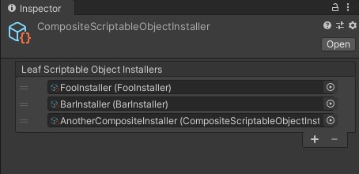
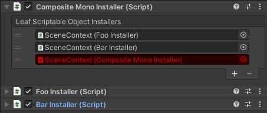

## Introduction
CompositeInstaller is the composite pattern of UniDi installers.  
CompositeInstaller can compose other installers and can be used as follows:

- A reusable installer of other installers group
- A loosely-coupled installer of other installers
- A proxy installer to installers for some features

For example, Suppose you use a CompositeScriptableObjectInstaller asset in a package provided by another developer.  
If the developer add some installers to the CompositeScriptableObjectInstaller asset in the package, all you need to do is update the package and you can receive features of the new installers.

## CompositeMonoInstaller
- Add "CompositeMonoInstaller" component to any GameObject
- Set "MonoInstaller"s (including "CompositeMonoInstaller") to "CompositeMonoInstaller"
- Set "CompositeMonoInstaller" to any "Context"

## Composite ScriptableObject Installer
- Select `Create > UniDi > Composite Scriptable Object Installer` to create the asset

- Set "ScriptableObjectInstaller"s (including "CompositeScriptableObjectInstaller") to "CompositeScriptableObjectInstaller"

- Set "CompositeScriptableObjectInstaller" to any Context

## Circular Dependency Warnings
- If any circular references are found in a composite installer, the property on the inspector will get red as a warning

  

